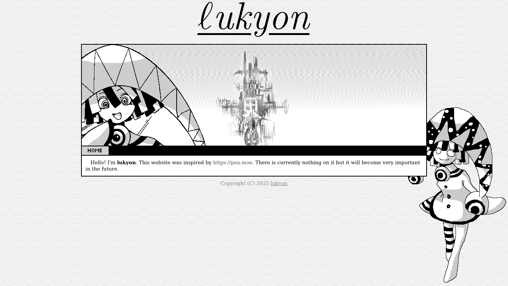

# Lukyon's Website
Hello! I'm lukyon. This website was inspired by https://pea.moe. There is currently nothing on it but it will become very important in the future. 



## Build & Serve via Docker

1. Build docker image `dockers/lukyon.org-nginx.dockerfile`
    ```
    $ docker build                               \
        -f ./dockers/lukyon.org-nginx.dockerfile \
        -t lukyon.org:latest                     \
        .
    ```
2. Run docker
    ```
    docker run                          \
        --detach                        \
        --name lukyon.org               \
        --publish 127.0.0.1:4000:80/tcp \
        --restart always                \
        lukyon.org:latest
    ```
3. Visit `http://localhost:4000` in your browser

## Author
Copyright (C) 2025 Lukyon

This program is free software: you can redistribute it and/or modify
it under the terms of the GNU Affero General Public License as
published by the Free Software Foundation, either version 3 of the
License, or (at your option) any later version.

This program is distributed in the hope that it will be useful,
but WITHOUT ANY WARRANTY; without even the implied warranty of
MERCHANTABILITY or FITNESS FOR A PARTICULAR PURPOSE.  See the
GNU Affero General Public License for more details.

You should have received a copy of the GNU Affero General Public License
along with this program.  If not, see <https://www.gnu.org/licenses/>.